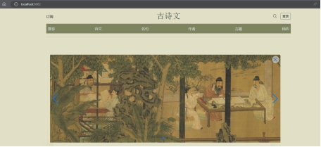
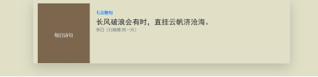
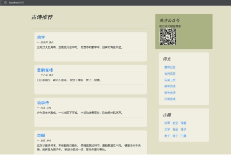
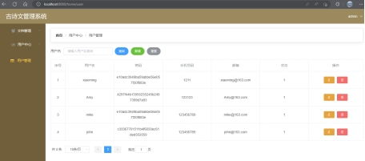
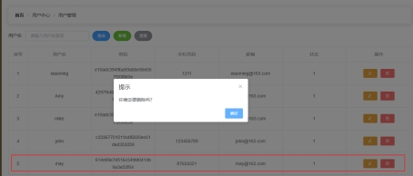

# 简介

本网站是根据在线学习的这种现状,提出解决问题的一个可行性方法：采用spring boot+mybatis技术，实现了管理和浏览古代诗歌和文章的系统，各类信息有序地进行存储，可进入系统主控界面，进行信息管理，信息查询等功能的使用。实现了各种业务系统的数据集成和信息集成，对学习文章各类信息、资源进行协同集中管理。

### 后端地址传送

[AKvtion/GushiSpringboot (github.com)](https://github.com/AKvtion/GushiSpringboot)


## 项目
```
npm install
```

### 项目编译并运行
```
npm serve run
```

### 项目构建
```
npm build
```


### 技术

#### 前端

vue

axios

elemene-UI

vue-router


### 效果图










